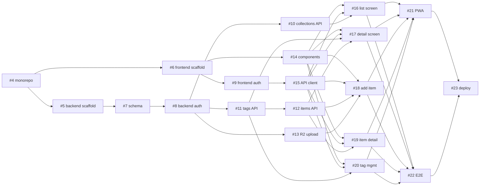

# Taggit v2 Rebuild — Roadmap

Tracking epic: [#3](https://github.com/jed-richards/taggit/issues/3)

Taggit is being rebuilt from a blank slate as a **React (TS) + FastAPI + PostgreSQL** monolith with **Cloudflare R2** image storage and **Supabase Auth** (Google OAuth, identity only). Architecture source of truth: [`docs/taggit-lld.md`](./taggit-lld.md). Visual/UX reference: the [`feat/claude-design`](https://github.com/jed-richards/taggit/tree/feat/claude-design) branch (SvelteKit prototype — reference only, no code ported).

Every issue is self-contained: an agent can pick one up with no context beyond its body.

## Phases and issues

| # | Issue | Phase | Area | Blocked by |
|---|---|---|---|---|
| [#4](https://github.com/jed-richards/taggit/issues/4) | Clear main & scaffold monorepo layout | P0 | infra | — |
| [#5](https://github.com/jed-richards/taggit/issues/5) | Backend scaffold: FastAPI + tooling + Postgres + CI | P0 | backend | #4 |
| [#6](https://github.com/jed-richards/taggit/issues/6) | Frontend scaffold: Vite + React + Tailwind + tokens | P0 | frontend | #4 |
| [#7](https://github.com/jed-richards/taggit/issues/7) | Database schema + initial Alembic migration | P1 | backend | #5 |
| [#8](https://github.com/jed-richards/taggit/issues/8) | Backend auth: Supabase JWT dependency | P1 | backend | #7 |
| [#9](https://github.com/jed-richards/taggit/issues/9) | Frontend auth: Google sign-in + route guard | P1 | frontend | #6 |
| [#10](https://github.com/jed-richards/taggit/issues/10) | Collections API | P2 | backend | #8 |
| [#11](https://github.com/jed-richards/taggit/issues/11) | Tags API | P2 | backend | #8, #10 |
| [#12](https://github.com/jed-richards/taggit/issues/12) | Items API (tag filtering AND/OR, atomic create) | P2 | backend | #11 |
| [#13](https://github.com/jed-richards/taggit/issues/13) | R2 presigned upload endpoint | P2 | backend/infra | #8, #10 |
| [#14](https://github.com/jed-richards/taggit/issues/14) | Design-system components | P3 | frontend | #6 |
| [#15](https://github.com/jed-richards/taggit/issues/15) | Typed API client + TanStack Query layer | P3 | frontend | #9 |
| [#16](https://github.com/jed-richards/taggit/issues/16) | Screen: Collections list | P3 | frontend | #14, #15, #10 |
| [#17](https://github.com/jed-richards/taggit/issues/17) | Screen: Collection detail + live tag filter | P3 | frontend | #14, #15, #11, #12 |
| [#18](https://github.com/jed-richards/taggit/issues/18) | Screen: Add item (upload + create-on-select) | P3 | frontend | #14, #15, #12, #13 |
| [#19](https://github.com/jed-richards/taggit/issues/19) | Screen: Item detail + related items | P3 | frontend | #14, #15, #12 |
| [#20](https://github.com/jed-richards/taggit/issues/20) | Screen: Tag management | P3 | frontend | #14, #15, #11 |
| [#21](https://github.com/jed-richards/taggit/issues/21) | PWA installability + mobile polish | P4 | frontend | #16–#20 |
| [#22](https://github.com/jed-richards/taggit/issues/22) | E2E happy path (Playwright) | P4 | full stack | #16–#20 |
| [#23](https://github.com/jed-richards/taggit/issues/23) | Dockerize + deploy | P4 | infra | #21, #22 |

**Backlog (post-v1):** [#2](https://github.com/jed-richards/taggit/issues/2) collection sharing/invites · item editing · tag merge · image compression/thumbnails · offline mode. [#1](https://github.com/jed-richards/taggit/issues/1) is superseded by the many-to-many schema in #7.

## Parallelism plan

Maximum concurrent agents per wave:

| Wave | Issues runnable simultaneously |
|---|---|
| 1 | #4 |
| 2 | #5 ∥ #6 |
| 3 | #7 ∥ #9 ∥ #14 |
| 4 | #8, then immediately: #10 ∥ #11 ∥ #13 ∥ #15 |
| 5 | #12 (once #11 merges) |
| 6 | #16 ∥ #17 ∥ #18 ∥ #19 ∥ #20 |
| 7 | #21 ∥ #22 (Docker portion of #23 can start early) |
| 8 | #23 final deploy |

## Dependency graph

## Working conventions

- One branch per issue, PR into `main`, `Closes #N` in the PR body
- Backend: Pydantic schema naming per the LLD (`CreateItemData` / `ListItemQuery` / `schemas.Item`); membership-scoped access on every resource route; ruff + pytest green
- Frontend: design tokens only (no hard-coded colors); light and dark themes both work; lint/typecheck/vitest green
- One-time manual setup owned by the repo owner (documented inside the relevant issues): Google OAuth + Supabase provider config (#9), R2 bucket + CORS (#13), hosting account (#23)
