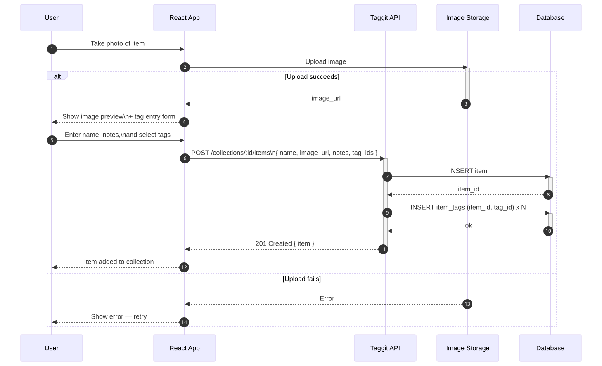

# Taggit — Low-Level Design

## Overview

Taggit is a React web app for managing personal collections. Users photograph physical items, organize them into named collections, and tag each item with descriptive labels. The core use case is allowing users to quickly filter a collection at the point of purchase to determine whether an item is already owned — e.g., checking a "Snoopy Mugs" collection while shopping, or referencing a "Birds" sighting log in the field. Collections can be shared with collaborators so multiple people can add and browse items together.

## Architecture

The app is organized around three concepts: **Collections** (e.g., "Snoopy Mugs"), **Items** (individual objects with a photo), and **Tags** (user-defined labels scoped to a collection). Tags are defined per-collection so that tagging vocabulary stays consistent within a domain. Items relate to tags via a join table, enabling arbitrary multi-tag filtering. Images are stored in a cloud object store (e.g., S3) and referenced by URL on the Item record — this keeps the database lean and avoids binary blob storage.

The key design decision is that **tags are collection-scoped**, not global. This means "red" in "Snoopy Mugs" is distinct from "red" in a different collection, allowing each collection to evolve its own vocabulary without cross-contamination. Tag inputs autocomplete from existing tags in the collection — this is essential for keeping tagging consistent across contributors.

The app is built as a **React (TypeScript) + FastAPI monolith** — one backend, one frontend, one deployment. The React frontend is PWA-compatible, making it installable on mobile without an app store. This is the right call for a small personal app; microservices would add operational overhead with no benefit at this scale. A collaborator model allows multiple users to share a collection — designed as a nice-to-have for v1, so the data model accounts for it from the start even if the UI ships later.

The backend follows a strict **models/schemas separation**: SQLAlchemy models map to DB tables (`models.Item`), while Pydantic schemas represent API shapes. Schema naming conventions:

- `[Action][Resource]Data` — request body (`CreateItemData`, `UpdateItemData`)
- `[Action][Resource]Query` — query parameters (`ListItemQuery`)
- `schemas.[Resource]` — response shape returned to the client (`schemas.Item`)
- Single-resource reads use a path parameter alone — no dedicated schema type needed

User identity (`user_id`) is extracted from the verified Supabase JWT via a FastAPI dependency — never accepted from the client payload.

## Tech Stack

| Layer | Technology |
|---|---|
| Frontend | React + TypeScript |
| Backend | FastAPI (Python) |
| Database | PostgreSQL |
| Image Storage | Cloudflare R2 (presigned URL upload — client uploads directly, bypassing the API server) |
| Auth | Supabase Auth (managed, OAuth via Google) |
| ORM | SQLAlchemy + Pydantic (separate models/schemas — no SQLModel) |
| Deployment | TBD — single monolith deployment |

## Diagrams

### Data Model

Shows the full entity model: a user owns collections, collections contain items and define their tag vocabulary, and items are linked to tags via the `ITEM_TAG` join table.

### At-the-Store Check Flow

The primary use case — a user at a store selects a collection, optionally applies tag filters, and determines from the results whether the item in front of them is already owned.

### Adding an Item

The full flow for adding a new item: photo upload to object storage, form entry for name/notes/tags, and a single API call that persists the item and its tag associations atomically.

## Interfaces

### REST API (proposed)

| Method | Path | Description |
|---|---|---|
| `GET` | `/collections` | List all collections for the authenticated user |
| `POST` | `/collections` | Create a new collection |
| `GET` | `/collections/:id/items` | List items, supports `?tags=christmas,red` filter |
| `POST` | `/collections/:id/items` | Add a new item with image and tags |
| `DELETE` | `/collections/:id/items/:itemId` | Remove an item |
| `GET` | `/collections/:id/tags` | List all tags defined in a collection |
| `POST` | `/collections/:id/tags` | Create a new tag in a collection |
| `GET` | `/collections/:id/tags?q=chr` | Search tags by prefix — powers autocomplete |

| `DELETE` | `/collections/:id/tags/:tagId` | Delete a tag (and all its ITEM_TAG associations) |
| `GET` | `/collections/:id/items/upload-url` | Get a presigned R2 URL for direct client upload |

### Tag Filtering

Tag filtering on `GET /collections/:id/items` uses **AND semantics** by default — `?tags=christmas,red` returns items tagged with both. An `?match=any` query param can opt into OR semantics.

### Pagination

`ListItemQuery` supports `limit` and `offset` parameters. Default `limit` is 50. This keeps large collections fast without requiring cursor-based pagination for v1.

### Tag UX

Tags support **create-on-select** in the item form — typing a new tag name and confirming creates it inline without leaving the flow. To prevent tag sprawl, a dedicated **tag management view** per collection allows explicit renaming and deletion. Deleting a tag cascades to remove all `ITEM_TAG` associations.

## Data Model

Six entities: `USER`, `COLLECTION`, `COLLECTION_MEMBER`, `ITEM`, `TAG`, and `ITEM_TAG`.

- `USER.id` is a UUID sourced from Supabase Auth — not a DB-generated integer.
- Tags are scoped to a collection (`collection_id` FK on `TAG`) — each collection defines its own vocabulary.
- `COLLECTION_MEMBER` is the collaborator join table with a `role` field (e.g. `owner`, `member`) to support permission levels later.
- `ITEM_TAG` is a pure join table with no extra attributes.
- `ITEM.image_url` stores a reference to cloud object storage, not raw binary data.

See the ER diagram above for full attribute detail.

## Error Handling

| Scenario | Behavior |
|---|---|
| Image upload failure | Surface error to user before form submission; do not create a partial item record |
| Tag not found in collection | API returns `400` — client must create the tag first |
| Item not found | API returns `404` |
| Unauthenticated request | API returns `401` |

## Planned: Collaborator Model

Collection sharing is a confirmed nice-to-have. The `COLLECTION` entity will need a `COLLECTION_MEMBER` join table (user_id, collection_id, role) to support inviting collaborators. The ER diagram will be updated when this feature is scoped. For now, the single-owner model ships first and the schema leaves room to extend.

**Invite flow:** The collection owner sends an email invite link. If the recipient doesn't have a Supabase account, the link takes them through account creation first, then drops them into the shared collection. Supabase Auth has built-in support for invite-by-email which maps cleanly to this flow.

## Open Questions

_None currently outstanding._
